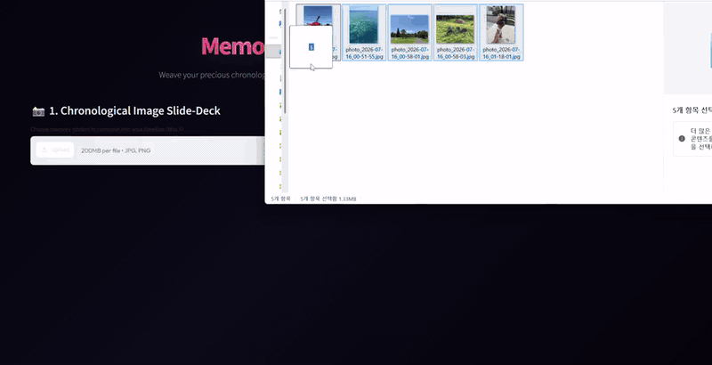
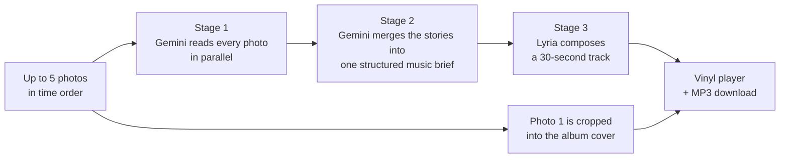
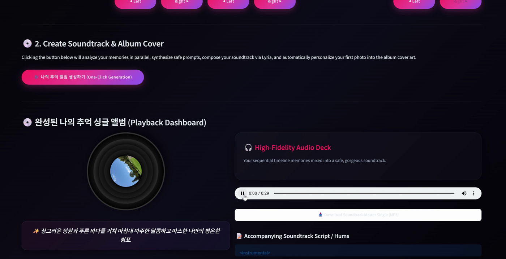

# Memory Soundtrack

**Turn a handful of photos into an original song.**

Upload up to five photos in the order they happened. Gemini reads each one and writes the story behind it, then all of those stories are merged into one musical brief, and DeepMind's Lyria composes a 30-second soundtrack from it. The result plays on a spinning vinyl record with your first photo as the album cover.

Built in one day at a Google hackathon (July 2026).



Full demo video (87 s, with audio): [`docs/media/demo.mp4`](docs/media/demo.mp4)

---

## How it works



| Stage | Model | What happens |
|---|---|---|
| 1. Read the photos | `gemini-3.5-flash` (multimodal) | One worker thread per photo. Each returns a short three-line story about the mood, light and composition, plus a hint of the instrumentation that would fit. |
| 2. Write the brief | `gemini-3.5-flash` (structured output) | All the stories go in together and a Pydantic schema comes out: a detailed `music_prompt` (genre, instruments, BPM, `[Intro]/[Main]/[Outro]`) and a one-line summary of the whole storyline. |
| 3. Compose | `lyria-3-clip-preview` | Lyria generates the track. The first photo is center-cropped to 512x512 and used as the cover. |



## What broke, and how I fixed it

Generative pipelines fail in ways normal code doesn't. I wrote up each incident as a root-cause report while building (in Korean, in [`docs/dev-notes/rca`](docs/dev-notes/rca)).

1. **The model disappeared.** `gemini-2.5-flash` started returning 404 for new API users mid-build. I moved to `gemini-3.5-flash` and made every model ID configurable from the sidebar so a deprecation doesn't need a code change. ([RCA 1](docs/dev-notes/rca/RCA_1_gemini_model_404.md))
2. **Cover art generation was unreliable.** The Imagen endpoint 404'd and image safety filters blocked some covers. Rather than keep patching it, I cut the stage: the user's own first photo becomes the cover. That removed a whole failure mode and made the output more personal. ([RCA 2](docs/dev-notes/rca/RCA_2_imagen_404.md))
3. **Structured output got cut off mid-JSON.** With five rich photo stories, the synthesis step sometimes hit the output-token ceiling and returned an unterminated string. The fix is layered: a much higher token ceiling, up to three retries with decreasing temperature, and a pre-written fallback brief so the pipeline never dead-ends. ([RCA 3](docs/dev-notes/rca/RCA_3_json_truncation.md))
4. **Lyria's content policy.** Prompts that mention real artists, brands or platforms are rejected. Generation now runs a self-healing loop: try the prompt; if blocked, strip known trigger terms with regex and have Gemini rewrite the prompt into purely descriptive language; if still blocked, fall back to a pre-cleared acoustic brief.

## Run it locally

Requires Python 3.10+ and a Gemini API key with Lyria access.

```bash
git clone https://github.com/molamolafortress/Google-Hackathon.git
cd Google-Hackathon
python -m venv .venv
source .venv/bin/activate        # Windows: .venv\Scripts\activate
pip install -r requirements.txt

cp .env.example .env             # Windows: copy .env.example .env
# then put your key in .env as GEMINI_API_KEY=...

streamlit run app.py             # Windows: or double-click run.bat
```

Vertex AI is also supported: open **Advanced Developer Settings** in the sidebar and enter a GCP project ID instead of an API key.

No photos handy? [`sample_photos/`](sample_photos) has 40 images in eight five-photo storylines (road trip, moving house, a puppy growing up, and so on).

Note: the app UI mixes English and Korean, and the generated stories are written in Korean.

## Project layout

```
app.py               the whole app (Streamlit UI + three-stage pipeline)
requirements.txt
.env.example         API key template (.env itself is git-ignored)
run.bat              Windows launcher
sample_photos/       40 test photos in 8 storylines
docs/media/          demo video, GIF and screenshots
docs/dev-notes/      brainstorming, implementation plans, checklists and RCA reports written during the build
```

## Stack

Python, Streamlit, Google Gen AI SDK (`google-genai`), Gemini 3.5 Flash, Lyria 3, Pydantic, Pillow.
