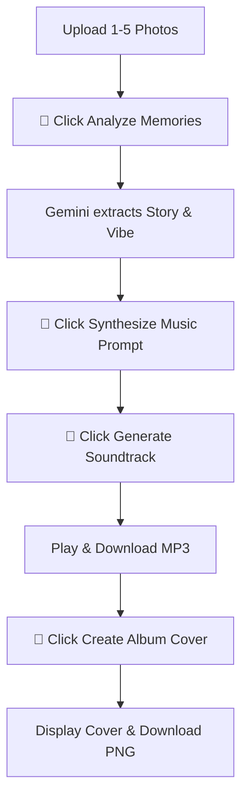

# Memory Soundtrack Generator Walkthrough

We have successfully developed and compiled the **Memory Soundtrack Generator** Streamlit application. The development steps, verification, and instructions are detailed below.

---

## Changes Implemented

### Streamlit Application
- **[NEW] [MemorySoundtrack_20260716_v3.py](file:///c:/Users/USER/Desktop/Google/MemorySoundtrack_20260716_v3.py)**: A single-file interactive Streamlit application containing:
  - Custom dark-theme CSS style with glassmorphic cards and elegant gradients.
  - Sidebar for API type selection (Gemini Developer API with API key or Vertex AI using Google Cloud Project).
  - Memory Photo Uploader (supports up to 5 photos).
  - Gemini Multimodal photo interpretation (스토리텔링 및 Vibe 분석) using the latest **`gemini-3.5-flash`** model.
  - Story synthesis to construct optimized Lyria music generation prompts.
  - DeepMind Lyria 3 clip composition via the `google-genai` `interactions` API.
  - Audio playback with `st.audio` and MP3 download options.
  - Imagen 3 album cover generation and display.
  - Automatic API key loading from `.env` with fallback configuration.

---

## Dependency Resolution & Verification

During local startup, a `ModuleNotFoundError` for `uvicorn` occurred due to a corrupted installation. We resolved it by performing a clean reinstall of `uvicorn`:
```powershell
python -m pip install --ignore-installed --no-deps uvicorn==0.51.0
```
This restored standard import functionality:
- **Verified**: `python -c "import uvicorn; print(uvicorn.__version__)"` succeeded and returned `0.51.0`.
- **Verified**: Compilation test for the app script using `py_compile` succeeded.

---

## Local Deployment

The Streamlit server was started and is successfully serving the application:
- **Local URL**: [http://localhost:8501](http://localhost:8501)
- **Network URL**: `http://192.168.0.191:8501`

---

## Step-by-Step Usage Guide



1. **Step 1: Upload & Analyze**
   - Access the application at [http://localhost:8501](http://localhost:8501).
   - Enter your Gemini API Key in the sidebar (if utilizing the Developer API).
   - Drag and drop up to 5 photos of your choice.
   - Click the **🧠 Analyze Memories** button to extract the narrative context and emotional vibes using Gemini.

2. **Step 2: Generate Music**
   - Head to the **Generate Music** tab.
   - Click **📝 Synthesize Music Prompt** to compile all stories into a cohesive English prompt.
   - Edit the prompt as needed.
   - Click **🎵 Generate Soundtrack via Lyria** to create your 30-second soundtrack and stream it.

3. **Step 3: Album Cover**
   - Head to the **Album Cover** tab.
   - Click **🎨 Create Album Cover via Imagen 3** to render a beautiful album art based on your memories.
