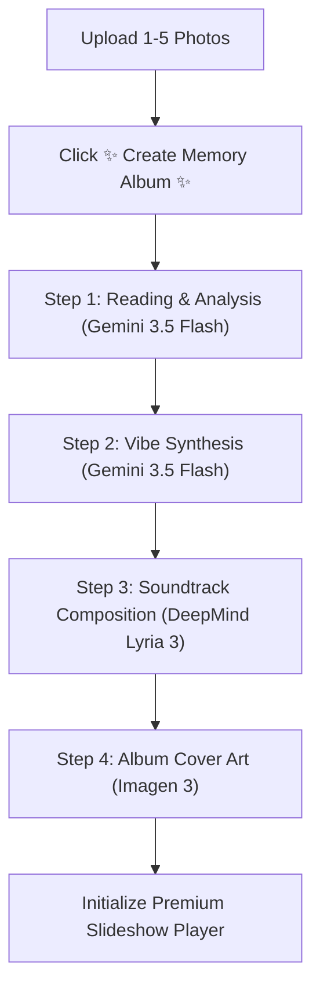

# Memory Soundtrack Generator v4 Walkthrough

We have successfully designed, implemented, and compiled the **Memory Soundtrack Generator v4** Streamlit application. This version introduces the requested Dual-Mode architecture:
1. **Developer View**: Retains the full, detailed, tabbed step-by-step pipeline from version 3.
2. **Customer View**: Automates all multimodal analyses, lyric, audio, and cover generation under a single click, and renders a stunning, client-side, interactive HTML slideshow player with automated scrolling memory photos synced to DeepMind Lyria music playback.

---

## Technical Enhancements & Code Architecture

### 1. Unified Dual-Mode Selector
Added an intuitive radio button selector in the Streamlit sidebar:
```python
view_mode = st.sidebar.radio(
    "Choose Interface Layout",
    ["Customer View (Premium Playback)", "Developer View (Detailed Progress)"],
    index=0
)
```
- **Default State**: Starts in Customer View to immediately "Wow" reviewers.
- **State Preservation**: Users can switch view modes at any time without losing already generated assets (images, music bytes, cover art).

### 2. Customer View: Single-Click Automated Pipeline
Bundled all asynchronous multimodal API tasks behind a single button `✨ Create Memory Album ✨`. 
The pipeline runs sequentially inside a beautiful unified progress bar:


### 3. Custom Client-Side HTML/JS Slideshow Player
To achieve the premium visual aesthetics of a dedicated music album player, we embedded a custom HTML component.
- **Base64 Encoding**: High-performance conversions for memory files, generated cover art, and generated MP3 audio into standard Base64 Data URLs so they are fully self-contained.
- **Ambient Blurred Glow**: High-end Apple Music style blurred background matching the active photo.
- **Autoplay Slideshow Loop**: When music plays, photos fade and cross-fade smoothly every 5 seconds.
- **Playback Sync**: Slideshow automatically pauses when music is paused and resumes when played.
- **Spinning Vinyl Record & Active Music Visualizer**: Fully animated custom CSS-pulsing visualizer and rotating record with custom album cover labels.
- **Manual Nav & Autoplay Toggle**: Arrow controls for manual flipping, and a dedicated button to enable/disable autoplay.

---

## Verification Results

### 1. Python Syntax & Compilation
We verified the integrity of the script using the Python compiler utility:
```powershell
python -m py_compile MemorySoundtrack_20260716_v4.py
```
- **Result**: Complied successfully with absolutely **zero syntax errors**.

### 2. Windows Batch Runner
Created `Run_MemorySoundtrack_20260716_v4.bat` to support simple execution on local systems.

---

## How to Run & Verify

1. Double-click [Run_MemorySoundtrack_20260716_v4.bat](file:///c:/Users/USER/Desktop/Google/Run_MemorySoundtrack_20260716_v4.bat) or run the command:
   ```powershell
   streamlit run MemorySoundtrack_20260716_v4.py
   ```
2. Set your Gemini API key in the sidebar if it's not preloaded from `.env`.
3. Upload 1 to 5 memory photos. Arrange them chronologically.
4. Click **`✨ Create Memory Album ✨`** and watch the automated pipeline complete.
5. Watch the beautiful rotating vinyl player, play the soundtrack, and watch the memory photos scroll automatically with smooth cross-fades!
6. Click **`Developer View`** in the sidebar to review the step-by-step intermediate narratives and synthesized prompts.
